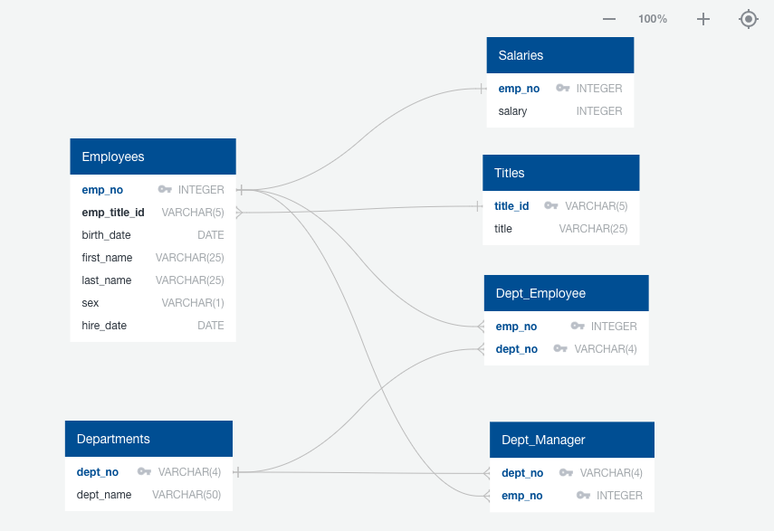

# Data Modelling, Data Engineering and Data Analysis

## Data Modelling
The CSV files were inspected and an Entity Relationship Diagram(ERD) of the tables was created using [https://www.quickdatabasediagrams.com/](https://www.quickdatabasediagrams.com/)

## Data Engineering

1. The Data Definition Language(DDL) scripts were created based on the ERD.
2. The database table schema was created in a PostgreSQL Database by running the DDL scripts using PgAdmin 
3. Each CSV file was then imported into its corresponding SQL table.

## Data Analysis

SQLs are created for the following analysis 

1. List the employee number, last name, first name, sex, and salary of each employee.

2. List the first name, last name, and hire date for the employees who were hired in 1986.

3. List the manager of each department along with their department number, department name, employee number, last name, and first name.

4. List the department number for each employee along with that employee’s employee number, last name, first name, and department name.

5. List first name, last name, and sex of each employee whose first name is Hercules and whose last name begins with the letter B.

6. List each employee in the Sales department, including their employee number, last name, and first name.

7. List each employee in the Sales and Development departments, including their employee number, last name, first name, and department name.

8. List the frequency counts, in descending order, of all the employee last names (that is, how many employees share each last name).

## Files

* ERD - Entity_Relationship_Diagram.png
* DDL script - EmployeeSQL/EmployeeDB_DDL.sql
* Analysis script - EmployeeSQL/EmployeeDB_Analysis.sql
* Data - EmployeeSQL/data

## Run Insturctions

* Install [PostgreSQL](https://www.postgresql.org/) and [PgAdmin](https://www.pgadmin.org/), if it's not already installed
* Launch PgAdmin
* Connect to the PostgreSQL server instance
* Create a new Database - EmployeeDB
* Open a Query Tool for EmployeeDB database
* Run EmployeeSQL/EmployeeDB_DDL.sql to create the tables
* Import data into each table from files under EmployeeSQL/data
* Open EmployeeSQL/EmployeeDB_Analysis.sql using Query Tool and run the SQL queries to analyze the data

# Disclaimer
This repo was published for educational purpose only. Copyright 2023-2024 edX Boot Camps LLC. All rights reserved.

